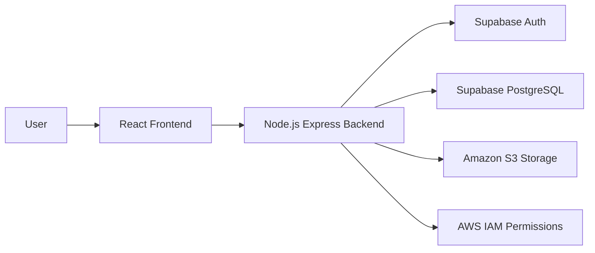

---

# Secure Cloud Document Management System

## 1. Introduction

This is a full-stack secure cloud document management system designed to provide a robust and safe environment for handling files. Users can securely authenticate to the platform and have full capabilities to upload, manage, download, and delete their documents. For maximum security and scalability, actual documents are stored securely using Amazon S3, while all document metadata is stored relationally in Supabase PostgreSQL. The backend APIs are fully protected using token-based authentication to ensure privacy and data integrity. Furthermore, the entire application is containerized using Docker, allowing for seamless deployment and reliable execution across any environment.

---

## 2. Features

- User registration
- User login/logout
- Supabase authentication
- Protected routes
- User dashboard
- Upload documents
- View document list
- Download documents
- Delete documents
- AWS S3 cloud storage
- Supabase PostgreSQL metadata storage
- REST API backend
- Docker containerization

---

## 3. Technology Stack

| Layer | Technology |
|---|---|
| Frontend | React + Vite + JavaScript |
| Styling | Tailwind CSS |
| Backend | Node.js + Express.js |
| Database | Supabase PostgreSQL |
| Authentication | Supabase Auth |
| Storage | Amazon S3 |
| Cloud Security | AWS IAM |
| Containerization | Docker |
| Version Control | Git/GitHub |

---

## 4. System Architecture

The following diagram illustrates the high-level architecture of the Secure Cloud Document Management System:



**Request Flow:**
1. **User** interacts with the React frontend.
2. **Frontend** sends HTTP requests to the Express backend.
3. **Backend** verifies authentication via Supabase Auth for protected routes.
4. **Backend** communicates with Supabase and AWS S3 to process the request.
5. **Document metadata** is stored and retrieved from the Supabase PostgreSQL database.

---

## 5. Project Structure

```text
project-root/
├── backend/
├── frontend/
├── supabase/
├── docker-compose.yml
├── README.md
└── .env.example
```

---

## 6. Backend Architecture

The backend is organized cleanly to separate concerns and ensure maintainability:

- **Routes (`src/routes`)**: Define the API endpoints for the application and map them to specific controllers.
- **Controllers (`src/controllers`)**: Contain the core request handling logic and coordinate between services and responses.
- **Middleware (`src/middleware`)**: Handle intermediate tasks such as verifying authentication tokens and validating uploaded files (e.g., using multer).
- **Services (`src/services`)**: Encapsulate the complex business logic, such as interacting with AWS S3 and querying the Supabase database.
- **Configuration (`src/config`)**: Manage configuration variables and integrations.
- **Database connections**: Implemented securely to interact with the Supabase PostgreSQL database.

---

## 7. Frontend Architecture

The frontend follows a modular React architecture:

- **Components (`src/components`)**: Reusable UI elements used across different views.
- **Pages (`src/pages`)**: Top-level React components representing distinct screens (e.g., Dashboard, Login).
- **Context/State Management (`src/context`)**: Manage global application state, primarily user authentication status.
- **API Services (`src/services`)**: Centralized functions to handle external HTTP requests to the backend API.
- **Routing**: Manage navigation between different pages and enforce protected routes using React Router.

---

## 8. Cloud Implementation

### Supabase
- **PostgreSQL Database**: A robust relational database powering the application.
- **Authentication**: Secure identity and access management for user sessions.
- **Document Metadata Storage**: The `documents` table stores essential metadata like filename, size, and S3 keys. Additional tables include `users` and `profiles` for user management.

### Amazon S3
- **Private Object Storage**: All files are stored privately in S3 buckets.
- **Upload Flow**: Files are securely uploaded through the backend to the S3 bucket.
- **Download using Presigned URLs**: Temporary, secure access is granted for downloading files via generated presigned URLs.
- **Delete Operations**: Removing a document removes the file from S3 alongside the metadata from Supabase.

### AWS IAM
- **Backend uses IAM credentials**: API keys are utilized by the backend to communicate with AWS S3.
- **Permissions are limited to required S3 actions**: Applying the principle of least privilege for security.
- **Credentials are stored using environment variables**: Keeping sensitive keys out of the source code.

---

## 9. Environment Variables

### Backend (`backend/.env`)

| Variable | Purpose |
|---|---|
| `PORT` | The port the backend server runs on |
| `SUPABASE_URL` | The endpoint URL for the Supabase project |
| `SUPABASE_ANON_KEY` | The anonymous key for Supabase public access |
| `SUPABASE_SERVICE_ROLE_KEY` | The service role key to bypass RLS policies on the backend |
| `AWS_REGION` | The region of the AWS S3 bucket |
| `AWS_ACCESS_KEY_ID` | The IAM access key ID for AWS |
| `AWS_SECRET_ACCESS_KEY` | The IAM secret access key for AWS |
| `AWS_BUCKET_NAME` | The name of the AWS S3 bucket |
| `FRONTEND_URL` | Allowed origin for CORS configuration |

### Frontend (`frontend/.env`)

| Variable | Purpose |
|---|---|
| `VITE_API_URL` | The base URL pointing to the backend API |
| `VITE_SUPABASE_URL` | The endpoint URL for the Supabase project |
| `VITE_SUPABASE_PUBLISHABLE_KEY` | The public publishable key for Supabase |

---

## 10. Installation and Setup

### Requirements
- Node.js
- npm
- Docker
- Supabase account
- AWS account

### Local Setup

**Backend:**
```bash
cd backend
npm install
npm run dev
```

**Frontend:**
```bash
cd frontend
npm install
npm run dev
```

---

## 11. Running With Docker

The application includes a `docker-compose.yml` file to quickly spin up the frontend and backend containers together.

**To start the application in Docker:**
```bash
docker compose up --build
```

**To stop the application:**
```bash
docker compose down
```

This will run the Node.js Express backend API and serve the React Vite frontend using their respective containers.

---

## 12. API Documentation

| Method | Endpoint | Description | Authentication |
|---|---|---|---|
| POST | `/api/auth/signup` | Register a new user | No |
| POST | `/api/auth/login` | Authenticate a user | No |
| POST | `/api/auth/logout` | Terminate user session | Yes |
| GET | `/api/auth/profile` | Retrieve user profile information | Yes |
| POST | `/api/documents/upload` | Upload a new document | Yes |
| GET | `/api/documents/` | Get list of user documents | Yes |
| GET | `/api/documents/:id/download` | Generate download link for a document | Yes |
| DELETE | `/api/documents/:id` | Delete a document | Yes |
